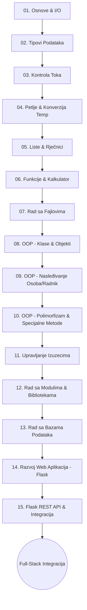

# SKOLICA — Python Programiranje
Dobrodošli u repozitorijum **SKOLICA_Python**! Ovaj repozitorijum je namenjen učenju i savladavanju programskog jezika Python. Python je poznat po svojoj jednostavnosti, ali i po svojoj izuzetnoj moći u oblastima web razvoja, analize podataka i veštačke inteligencije. U našem full-stack ekosistemu, Python služi kao backend engine za obradu podataka i obezbeđivanje REST API endpoint-a preko Flask-a.

---

## 🗺️ Tok Učenja (Mermaid Diagram)



---

## 📂 Organizacija Repozitorijuma

Repozitorijum je organizovan po **Grupama** polaznika (npr. `Grupa1`, `Grupa2`, itd.). Svaka grupa ima svoj folder u kome se nalazi identičan, ali prilagođen nastavni plan i program koji prolazi kroz **15 nastavnih oblasti**.

Svaka nastavna oblast se sastoji od **3 predavanja**:
*   **predavanje_1**
*   **predavanje_2**
*   **predavanje_3**

Unutar svakog predavanja nalaze se sledeći fajlovi:
1.  `lekcija.md` — detaljno teorijsko objašnjenje koncepata, sintakse i primera.
2.  `primer.py` — praktičan kodni primer koji demonstrira naučene koncepte.

---

## 🛠️ Uputstvo za Pokretanje Koda

Da biste pokrenuli Python primere na vašem računaru, potreban vam je instaliran Python interpreter (preporučuje se Python 3.8 ili noviji).

### Pokretanje
Otvorite terminal (ili komandnu liniju), pozicionirajte se u folder predavanja i pokrenite sledeću komandu:

```bash
python3 primer.py
```

*Napomena: Za oblasti vezane za baze podataka (Oblast 13) ili Flask (Oblasti 14 i 15), proverite da li imate instalirane potrebne eksterne zavisnosti (npr. `pip install flask` ili `pip install Flask-Cors`).*

---

*Srećno učenje! Python je savršen alat koji balansira brzinu razvoja i ogromne mogućnosti u industriji.*
